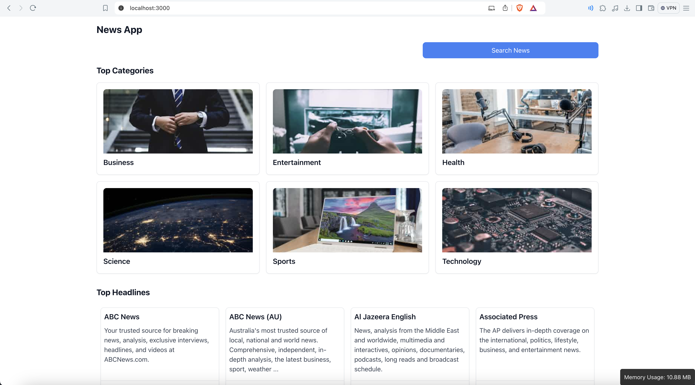
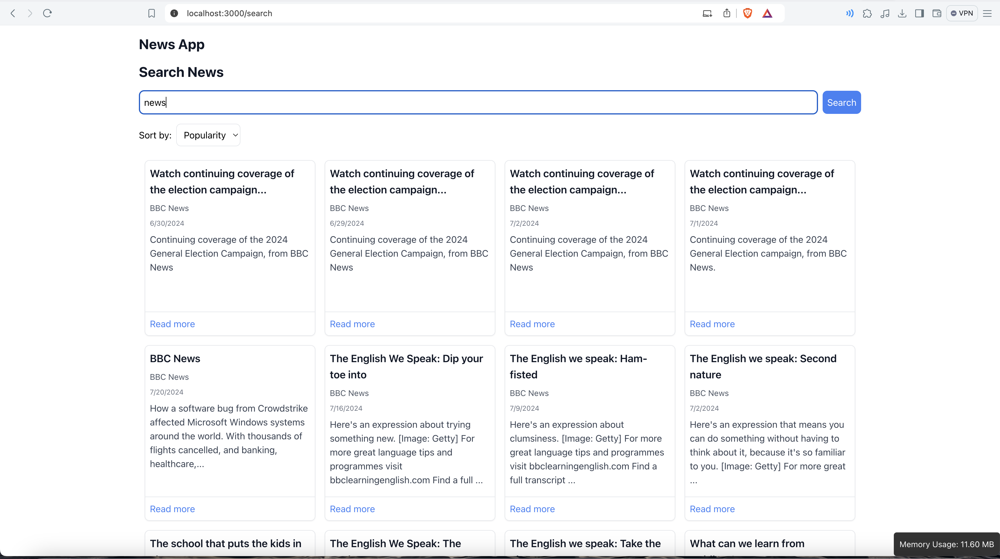
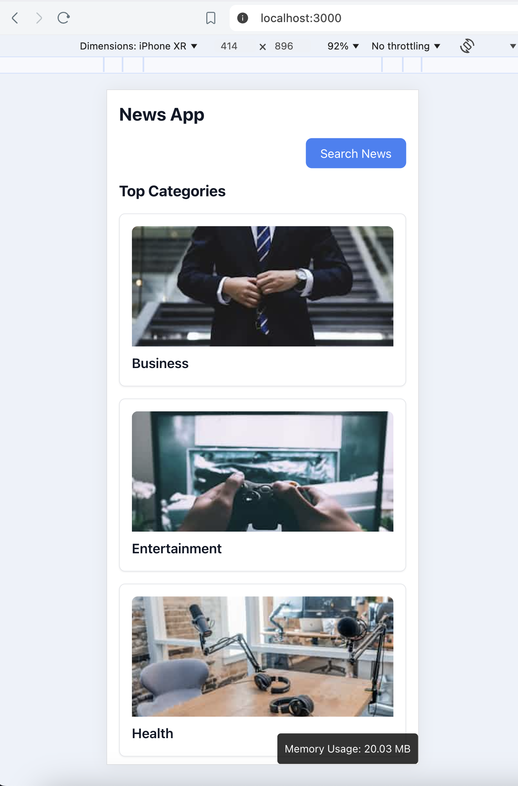
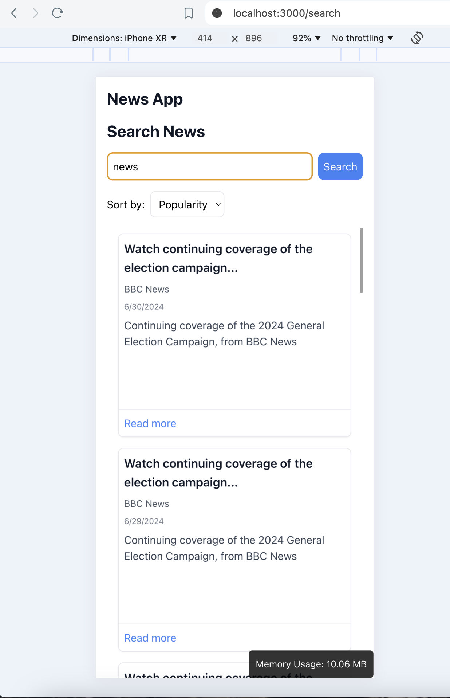

### Setup intructions
- clone this repo
- npm install
- npm run start

### Decisions
- I have used react router dom for routing
- Three pages are defined: homepage, category, and search.
- Each page uses various components.

### Limitations
- The NewsAPI, as provided in the link, does not support hosted apps on the free plan. To check the functionality, please run this on a local machine.
- Due to time constraint I have not added test cases as of now.

### Screenshots

### Performance Optimizations 
- I have used pagination in api responses.
- Lazy loaded images with smaller file size.
- Used virtualization to render only a limited number of elements in the DOM, instead of loading 20 elements when only 9 are shown to the user at once.

### Hosted Link
- https://flamingo-richpanel.netlify.app/
- API responses are not working on this link due to free plan limitations. Please check the functionality on a local setup as requests from hosted environments are not supported by the free plan.